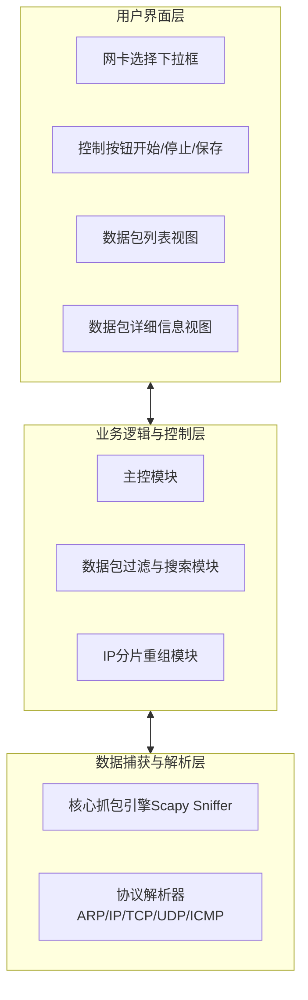
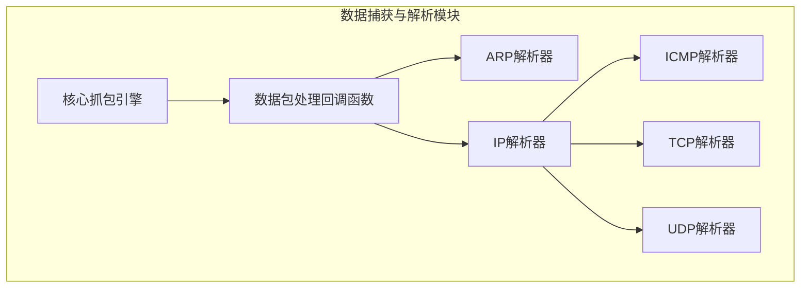
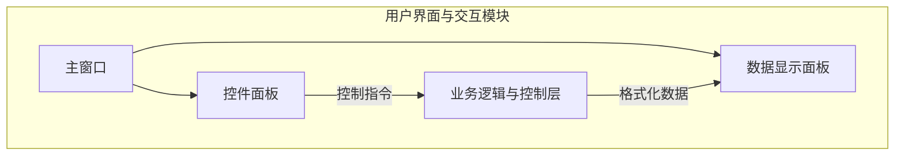

---

**项目总体设计报告** 1

**项目名称：** 基于Python的网络嗅探器设计与实现 

**姓名：** 孙靖峰、周则衡、徐天诣、陈宇轩、钱恒

**学号：** 522111910068、523031910682、523031910643、523031910177、523031910500

**学院：** 计算机科学学院（网络安全学院）

**报告完成日期：** 2025年7月4日

---

### 1.系统需求分析

**1.1 需求分析** 

本系统旨在解决网络流量监控与安全分析中的信息不透明问题。在复杂的网络环境中，网络管理员或安全分析人员难以直观地捕获和理解主机上的实时数据流。未经分析的网络数据包可能隐藏着潜在的安全威胁，例如未经授权的访问、异常的数据传输或是网络攻击的前兆。本系统通过提供一个能够捕获、解析和分析网络数据包的工具，对本机的网络流量进行安全增强，帮助用户洞察网络行为、排查故障和识别潜在风险。 

**1.2 总体功能要求** 

系统的总体功能是设计并实现一个具备图形用户界面的网络嗅探器，其核心功能如下：

- **网卡选择与数据包捕获并允许用户从本机安装的多个网络接口卡（网卡）中选择一个进行监听。 
    
- **实时数据包解析**：能够侦听所选网卡上所有进出的数据包，并对这些数据包进行深度解析。 解析协议应至少包括ARP、IP、ICMP、TCP、UDP。 
    
- **可读化信息展示**：解析后的数据包头部各字段内容及数据部分需以用户友好、可读性高的方式呈现。 
    
- **IP分片重组**：系统需要具备处理IP分片的能力，将分段传输的IP包重组为完整的数据包。 
    
- **用户交互功能**：提供过滤、搜索、保存日志等辅助功能，以提升用户体验和分析效率。 
    

**任务分工：** 

- **组员A (项目组长)**：负责系统总体架构设计 、核心抓包与解析模块的实现、以及团队协调与进度管理。 
    
- **组员B (UI/UX设计师)**：负责设计和实现友好的图形用户界面（GUI） ，包括窗口布局、控件交互和信息可视化。
    
- **组员C (协议分析师)**：专注于数据包解析逻辑的深化，负责ARP、IP、ICMP协议的精确字段解析与信息提取。 
    
- **组员D (协议分析师)**：专注于TCP和UDP协议的解析，包括端口、标志位、序列号等关键信息的处理与展示。 
    
- **组员E (功能与测试工程师)**：负责IP分片重组功能的实现与测试 ，并负责整体软件的测试，确保在执行Ping、网页浏览等操作时结果正确。 
    

**1.3 软件开发平台要求** 

- **编程语言**：Python 3.x 
    
- **核心库**：Scapy (用于抓包和解析)、Tkinter (用于GUI) 
    
- **开发环境**：Windows或Linux操作系统均可 
    

**1.4 运行环境要求** 

系统需在安装了Python环境和相应库（Scapy, Tkinter）的Windows或Linux主机上运行，并需要管理员/root权限以访问底层网络接口。 

### 2.计划进度安排

- **第一周**：完成需求分析、技术选型和总体设计，搭建开发环境。
    
- **第二周**：完成核心抓包模块和基础协议（ARP, IP）解析模块的开发。
    
- **第三周**：完成TCP/UDP/ICMP等协议的解析，并完成IP分片重组功能。
    
- **第四周**：完成GUI界面的设计与开发，并与后端逻辑集成。
    
- **第五周**：进行系统联调、功能测试、Bug修复和文档编写，准备最终交付。
    

### 3.系统总体架构

**3.1 平台架构** 

本系统是一个单机版桌面应用程序，直接运行在用户的个人主机上。 它通过调用操作系统底层的网络接口库（由Scapy封装），以非侵入式的方式监听指定网络接口的流量，所有数据的捕获、处理和展示均在本地完成，不依赖外部服务器。 

**3.2 总体架构** 

系统采用分层架构设计，将用户交互、业务逻辑和数据捕获分离，以实现高内聚、低耦合。 

功能逻辑图:

**模块说明：** 

1. **用户界面层 (GUI)**：作为系统的最顶层，直接面向用户。 它负责展示数据和接收用户指令，如选择网卡、启停抓包等，然后将指令传递给业务逻辑层。 
    
2. **业务逻辑与控制层**：作为中间层，是系统的“大脑”。它接收来自GUI的指令，调用底层抓包引擎；同时对底层返回的数据进行处理，如执行过滤、搜索和IP分片重组，最后将格式化好的数据反馈给GUI进行展示。 
    
3. **数据捕获与解析层**：作为最底层，负责与操作系统网络核心交互。 它使用Scapy库捕获原始数据包，并利用内置的解析器对各个协议层进行解构，提取出关键字段。 
    

### 4.系统功能模块1：数据捕获与解析

**4.1 模块结构** 

**关系说明：** 核心抓包引擎捕获到每个数据包后，会立即调用一个统一的回调函数。该回调函数作为分发器，根据数据包的协议类型（如ARP或IP）将其交给相应的解析器进行处理。IP解析器处理后，会进一步根据其上层协议类型（如ICMP, TCP, UDP）分发给对应的解析器。 

**4.2 子模块1：核心抓包引擎** 

- **功能**：监听用户选定的网络接口，捕获流经该接口的所有网络数据包。
    
- **结构**：基于Scapy库的`sniff()`函数构建。该函数将在一个独立的后台线程中运行，以避免阻塞GUI主线程。
    
- **技术实现**：通过`threading`库创建新线程，在该线程中调用`scapy.sniff(iface=selected_interface, prn=callback_function)`。`prn`参数指定了每捕获一个包就要调用的处理函数。 
    
- **逻辑处理**：引擎启动后持续监听，直到收到停止信号。所有捕获到的原始数据包都原封不动地传递给回调函数。 
    

**4.3 子模块2：协议解析器** 

- **功能**：对原始数据包进行解析，提取ARP, IP, ICMP, TCP, UDP等协议的关键字段信息。 
    
- **结构**：由多个针对特定协议的函数组成，例如`parse_arp()`, `parse_ip()`, `parse_tcp()`等。
    
- **技术实现**：利用Scapy强大的协议分层能力。例如，通过`packet.haslayer(TCP)`来判断包中是否含有TCP层，通过`packet[TCP].sport`来直接获取源端口号。 
    
- **逻辑处理**：回调函数首先判断数据包的最外层协议，调用相应解析器。解析器提取信息后，将其构造成一个标准化的数据结构（如字典或元组），供上层模块使用。 
    

### **5. 系统功能模块2：用户界面与交互**

#### **5.1 模块结构**

**关系说明：** 主窗口集成了控件面板和数据显示面板。用户通过控件面板下达指令，指令通过业务逻辑层驱动后端工作。后端处理完成的数据，再由业务逻辑层格式化后，发送到数据显示面板进行实时更新。

**5.2 子模块1：控件面板** 

- **功能**：提供用户与程序交互的全部控件，包括网卡选择、启停按钮、保存按钮等。 
    
- **结构**：一个容器（Frame），内部包含一个下拉框（Combobox）用于选择网卡，以及多个按钮（Button）用于触发操作。
    
- **技术实现**：使用Tkinter库的`ttk.Combobox`和`ttk.Button`等控件。按钮的`command`属性绑定到业务逻辑层的对应方法。
    
- **逻辑处理**：界面初始化时，调用后端方法获取网卡列表并填充下拉框。用户点击按钮时，执行绑定的函数，同时根据程序状态（如正在抓包时）禁用或启用相关按钮。
    

**5.3 子模块2：数据显示面板** 

- **功能**：以清晰的格式展示捕获到的数据包列表和选定数据包的详细信息。 
    
- **结构**：由两部分组成，上方是一个表格视图（Treeview），用于展示数据包摘要列表；下方是一个文本框（ScrolledText），用于显示选中数据包的完整解析内容。
    
- **技术实现**：使用`ttk.Treeview`控件来模拟表格，可定义列（时间、源/目的地址、协议等）。使用`scrolledtext.ScrolledText`控件显示详细信息。
    
- **逻辑处理**：业务逻辑层将新捕获并解析好的数据包摘要信息传递给该模块，模块将其作为新的一行插入到Treeview的末尾。当用户在Treeview中点击某一行时，触发事件，从数据缓存中获取该数据包的详细解析文本，并更新到下方的文本框中。
    

### 6.运行平台

**6.1 软件平台** 

- 操作系统：Windows 10/11, 或主流Linux发行版 (如Ubuntu 20.04+)。 
    
- 运行环境：Python 3.8 或更高版本。
    
- 必需库：Scapy, Tkinter (通常随Python发行版提供)。
    

**6.2 硬件平台** 

- 处理器：1 GHz 或更快的处理器。
    
- 内存：至少 512 MB RAM。
    
- 网络接口：至少一个活动的以太网或Wi-Fi网络接口卡。
    

### 7.接口设计

本系统主要涉及内部模块间的接口设计。

- **UI层 -> 业务逻辑层**：
    
    - `start_capture(interface_name)`: 启动抓包。
        
    - `stop_capture()`: 停止抓包。
        
    - `save_log(file_path)`: 保存日志。
        
- **业务逻辑层 -> UI层**：
    
    - `update_packet_list(packet_summary)`: 更新数据包列表视图。
        
    - `update_packet_details(packet_details)`: 更新详细信息视图。
        
- **业务逻辑层 -> 数据捕获层**：
    
    - `sniff_packets(interface, callback)`: 调用底层抓包。
        
    - `stop_sniffing()`: 设置停止标志。
        

### 8.系统出错处理设计

| 错误产生原因          | 提示信息                                 | 建议处理办法                                                  |
| --------------- | ------------------------------------ | ------------------------------------------------------- |
| **未以管理员权限运行**   | "权限错误：无法打开网络接口。请尝试以管理员身份运行本程序。"      | 关闭程序，右键点击程序或脚本，选择“以管理员身份运行”（Windows）或使用`sudo`命令（Linux）。 |
| **未选择任何网络接口**   | "操作错误：请在开始抓包前选择一个网络接口。"              | 在下拉菜单中选择一个有效的网络接口再点击“开始”。                               |
| **选择的接口无效或无活动** | "警告：选择的接口上没有检测到数据包。请确认接口是否已连接并正常工作。" | 检查网络连接状态，或尝试选择其他网络接口。                                   |
| **文件保存失败**      | "文件错误：无法将日志保存到指定路径。请检查路径是否有效及写入权限。"  | 选择一个有权访问的本地磁盘路径进行保存。                                    |